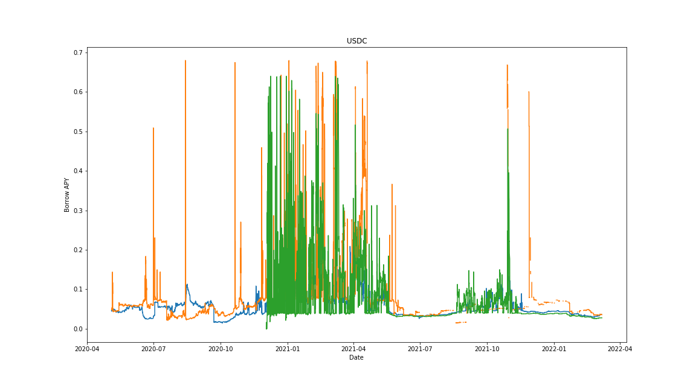
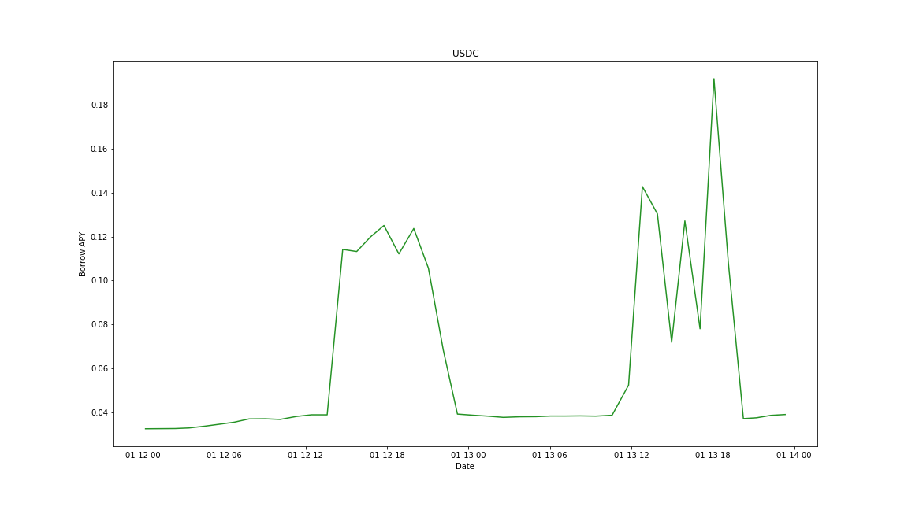
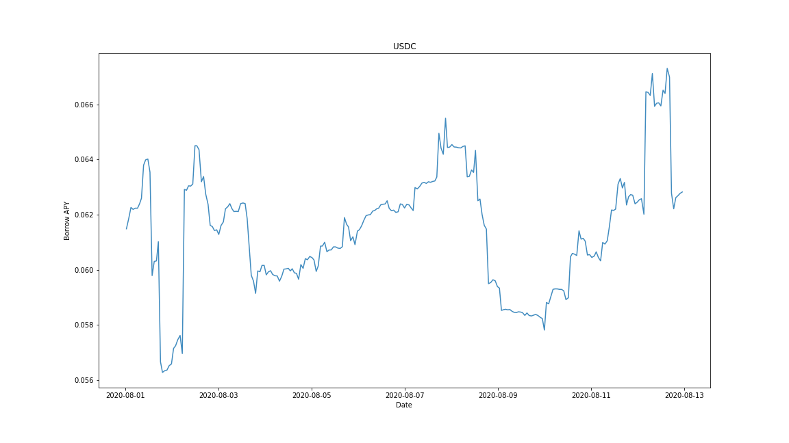
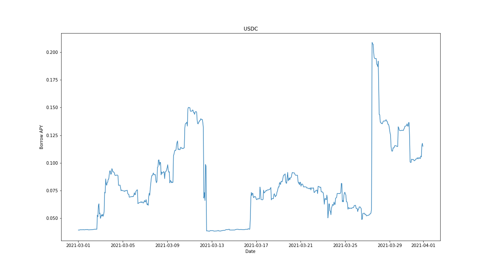

[](http://quantlet.de/)

## [](http://quantlet.de/) **ratePlots** [](http://quantlet.de/)

```yaml

Name of QuantLet: ratePlots

Published in: p2pInterestRate

Description: Interest rate plots of USDC hourly borrowing rate on Compound, AAVE v1 and v2. 

Keywords: p2p, lending, crpyto, CP2P, interest rate, borrowing rate, stochastics

Author: Francis Liu

Submitted: Wed, June 8 2022 by Francis Liu

```









### [IPYNB Code: ratePlots.ipynb](ratePlots.ipynb)


automatically created on 2023-02-18