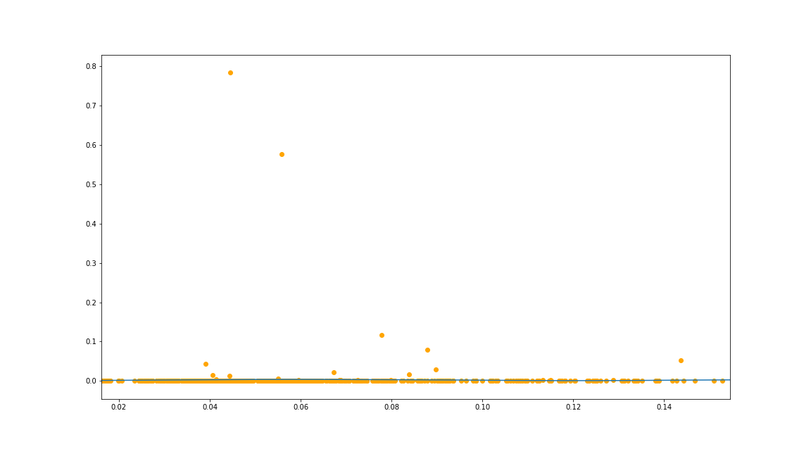

[](http://quantlet.de/)

## [](http://quantlet.de/) **semiParametricModel** [](http://quantlet.de/)

```yaml

Name of QuantLet: semiParametricModel

Published in: p2pInterestRate

Description: Kernel regression to estimate the conditional instantaneous moments of CP2P borrowing rate. 

Keywords: p2p, lending, crpyto, CP2P, interest rate, borrowing rate, stochastics, kernel method

Author: Francis Liu

Submitted: Wed, June 8 2022 by Francis Liu
```





### [IPYNB Code: semiParametricModel.ipynb](semiParametricModel.ipynb)


automatically created on 2022-06-09